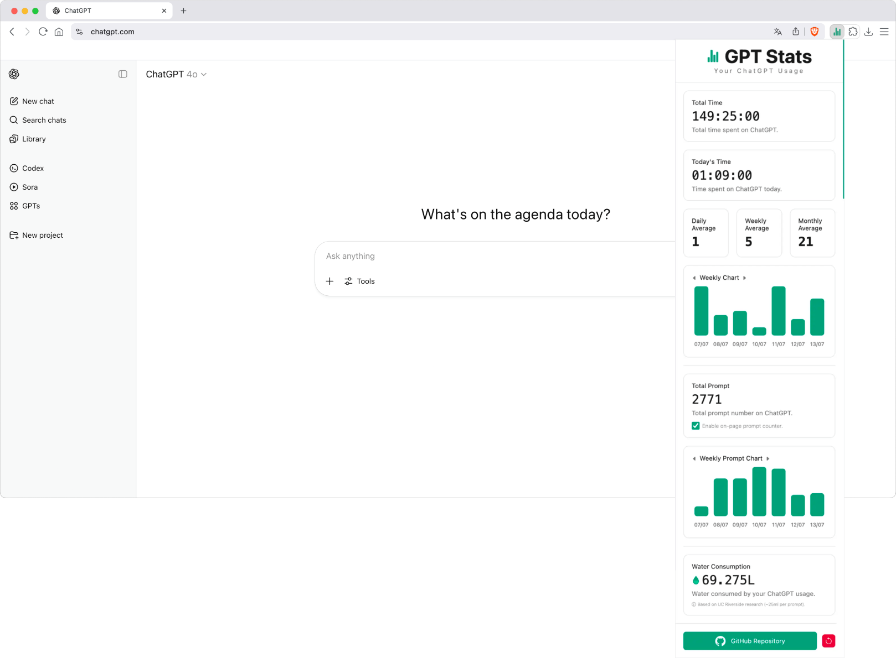

# GPT Stats

## Description

GPT Stats is a lightweight Chrome extension that tracks [ChatGPT](https://chatgpt.com/) usage effortlessly. It automatically measures the time you spend, counts your prompts, and displays useful usage statistics, all in a clean and minimal popup interface.

All data is stored locally in your browser using `chrome.storage.local`, ensuring full control, offline compatibility, and compliance with modern extension security standards.

Whether you're curious about your productivity, want to better understand your usage habits and environmental impact, or just love data, GPT Stats gives you clear insights without compromising performance or privacy.

## Objectives

- Track the time spent on ChatGPT.
- Count the number of prompts sent.
- Provide a visual dashboard using `Chart.js`.
- Estimate water consumption based on usage patterns.
- Persist usage data across browser sessions.
- Ensure everything works offline, locally, with no external dependencies.

## Tech Stack


## File Description

| **FILE**        | **DESCRIPTION**                                                           |
| :-------------: | ------------------------------------------------------------------------- |
| `assets`        | Contains the resources required for the repository.                       |
| `manifest.json` | Chrome manifest file (V3) that declares extension metadata.               |
| `background.js` | Background service worker, manages session timing.                        |
| `popup`         | Contains the popup interface: `popup.html`, `popup.css`, and `popup.js`.  |
| `scripts`       | Placeholder for extra logic or utility functions.                         |
| `libs`          | Contains local dependencies.                                              |
| `images`        | Folder containing icons or UI images.                                     |
| `README.md`     | The README file you are currently reading 😉.                             |

## Installation & Usage

### Installation:

1. Clone this repository:
    - Open your preferred Terminal.
    - Navigate to the directory where you want to clone the repository.
    - Run the following command:

```
git clone https://github.com/fchavonet/chrome_extension-gpt_stats.git
```

2. Open a Chromium-based browser (Brave, Edge, Google Chrome...) and navigate to:

```
chrome://extensions/
```

3. Enable Developer Mode (top-right corner).
   
4. Click on "Load unpacked" and select the project folder.

5. The extension should now appear in your extensions menu.

> You can pin it to your browser toolbar via your extensions menu.

### Usage

1. Open [ChatGPT](https://chatgpt.com/) in your browser.

2. The extension will automatically start tracking your usage time.

3. Each prompt you send is counted in real time.
   <br>
   ( ⚠️ Make sure you're logged into your OpenAI account for prompt tracking to work! ⚠️ )

4. Click the extension icon to open the popup and view your usage statistics.

5. All data is stored locally and will persist across browser restarts.

6. If you just want to test the extension without waiting, you can inject some mock data using the script below.

<details>
    <summary>
    Click here to see the code.
    </summary>

```
(function simulateUsageHistory() {
    const now = new Date();
    const dailyUsage = {};
    const dailyPromptCount = {};

	for (let i = 0; i < 185; i++) {
		const date = new Date();
		date.setDate(now.getDate() - i);

		const yyyy = date.getFullYear();
		const mm = String(date.getMonth() + 1).padStart(2, "0");
		const dd = String(date.getDate()).padStart(2, "0");

		const key = `${yyyy}-${mm}-${dd}`;

		const seconds = Math.floor(Math.random() * (90 - 5 + 1) + 5) * 60;
		dailyUsage[key] = seconds;

		dailyPromptCount[key] = Math.floor(Math.random() * 30) + 1;
	}

	const totalPrompt = Object.values(dailyPromptCount).reduce((a, b) => a + b, 0);

	chrome.storage.local.set({
		dailyUsage: dailyUsage,
		dailyPromptCount: dailyPromptCount,
		promptUsage: totalPrompt
	}, () => {
		console.log("✅ Simulated 6 months of usage data successfully injected.");
	});
})();
```
</details>

> Right-click the opened extension → Inspect → open the Console tab, then paste and run the code.

<p align="center">
	<picture>
		<source media="(prefers-color-scheme: dark)" srcset="./assets/images/desktop_screenshot-dark.webp">
		<source media="(prefers-color-scheme: light)" srcset="./assets/images/desktop_screenshot-light.webp">
		
	</picture>
</p>

You can also install the Chrome extension directly from the Chrome Web Store by clicking [here](https://chromewebstore.google.com/detail/gpt-stats/gpicllelofjlednfbblbmjdlolpjonll?hl=fr).

## What's Next?

- Implement CSV export of usage data.
- Improve or redesign the mobile layout.
- Add additional usage metrics.
- Explore Firefox support.

## Thanks

- A big thank you to my friends Pierre and Yoann, always available to test and provide feedback on my projects.

## Author(s)

**Fabien CHAVONET**
- GitHub: [@fchavonet](https://github.com/fchavonet)
